# Increasing Accessbility of Early, Elementary, and Secondary Education Information for Parents 

--------

## Karlina Ho || DGT HUM 110 || Assignment 01: Heuristic Evaluation
### Description: 
##### A leading predictor regarding academic success and achievement among students revolves around the degree to which parents are involved in their child's education. Yet, numerous digital platforms and webpages often showcase inaccessible content for marginalized groups of parents including non-English speakers, disabled persons, and individuals with age-related impairments/disabilities. With the goal of educational sites to allow educators and government officials the ability to connect with parents and relay crucial information regarding their child's education, website accessibility remains essential for educational equity. Consequently, this assignment delves deeper into the government-affiliated sites of the Early and Elementary plus Secondary education sites of Massachusetts and analyzes their accessibility and usability through a heuristic  evaluation. 

### [Jakob Nielson's 10 Usability Heurisitcs](https://www.nngroup.com/articles/ten-usability-heuristics/)
|Number|Heuristic|Definition|
|---|---|---|
|1|Visibility of System Status|Design should keep users informed and knowledgeable about what is going on. This is achieved through appropriate feedback within an appropriate time frame.|
|2|Match Between System and the Real World|The design should speak the language of the user. Utilize words, concepts, and phrases that the user is acquainted with instead of internal jargon. Follow real-world conventions and make the information appear naturally and logically.|
|3|User Control and Freedom|Users often make mistakes. As a result, an "emergency exit" that is clearly marked is needed to provide them an escape route to leave the unwanted or unintentional action without having to go through a lengthened process.|
|4|Consistency and Standards|Users should not think about whether different words, actions, or situations have the same meaning. Therefore, one should follow platform and industry conventions.|
|5|Error Prevention|Good error messages are key, but the best designs can prevent problems from arising in the first place. Consequently, either eliminate error-prone conditions or examine for them and provide users with a confirmation option before they commit to and execute the action.|
|6|Recognition Rather than Recall|Reduce the memory load of the user by making actions, options, and elements detectible. The user should not need to remember information from one part of the interface to another part. Information needed to utilize the design (e.g. field labels or menu items) should be clearly visible or easily retrievable when required.|
|7|Flexibility and Efficiency of Use|Shortcuts — which are hidden from novice users — can accelerate the interaction for the expert user where the design can accommodate to both inexperienced and experienced users alike. Therefore, allow users to tailor and personalize frequent actions.|
|8|Aesthetic and Minimalist Design|Interfaces should not have information that is unimportant or unnecessary. Extra units of information in an interface rival with more relevant units of information, which can ultimately decrease their relative visibility.|
|9|Help Users Recognize, Diagnose, and Recover from Errors|Error messages should be expressed in plain and simple language (no error codes). They should directly reveal the problem and constructively suggest a solution.|
|10|Help and Documentation|It is best if the system doesn’t need any additional explanation. However, it may be needed to supply documentation to help users understand how to complete their tasks.|

### [Severity Ratings for Usability Problems by Nielsen Norman Group](https://www.nngroup.com/articles/how-to-rate-the-severity-of-usability-problems/)
|Rating|Description|
|---|---|
|1|Cosmetic problem only: does not need to be fixed unless extra time is available on project|
|2|Minor usability problem: slight fix needed, low priority|
|3|Major usability problem: important to fix, high priority|

--------
### Website 1: [Massachusetts Department of Early Education and Care](https://www.mass.gov/orgs/department-of-early-education-and-care)
### Site Overview: 
#### The Massachusetts Department of Early Education and Care (EEC) is part of the Executive Office of Education and the chief agency regarding the entirety of early education and care services found in the Commonwealth. As 1 of the 9 Executive Offices under the Massachusetts governor Charlie Baker, the EEC sets the politics and regulations affiliated to early education and care services and programs. Additionally, the site provides various resources, programs, certifications, and news made to assist caregivers with childhood development. 
#### In my heuristic evaluation, my perspective will focus on a parent who uses English as their second language, is visually and physically impaired, and is interested in learning more about various resources and programs for improvement upon their child's early childhood development. As a result, reading websites and decreased motor control will greatly affect their user experience throughout the site. My overall evaluation of the site before my heuristic evaluation is that the site is fairly easy to navigate, with key information presented in visualizations and easy-to-find links. Additionally, the site allows users to personalize the page by selecting a language of their choice. However, throughout many of the pages on the site, it can be argued that too many hyperlinks are utilized for users to access necessary plans, portals, and services which can impact not just the ease of access to documents for users, but also readability to parents with visual impairments as a fair amount of text is written in blue. For example, in order to learn about financial assistance for early education and care, users must click through a drop down menu, scroll down and click on another hyperlink, and then utilize a dropdown menu to directly access specfic information. Users are then provided with descriptions with additional hyperlinks, overall creating a hyperlink loop. 

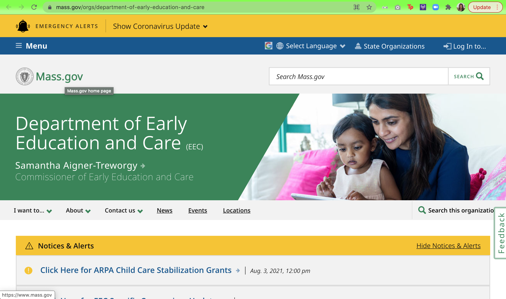

### Heuristic Evaluation: 
Heuristic | EEC Heuristic Evaluation | Recommendation | Severity Rating
--------------------------|---------------------------|------------|----------------------
**Visibility of System Status** | **Issue:** When users hover over the menu bar on the words, "News," "Events," and "Locations," the links do not change color, bold, nor provide any type of system status to acknowledge to the user that the site is responding to their mouse hovering over the link unlike its dropdown counterparts. 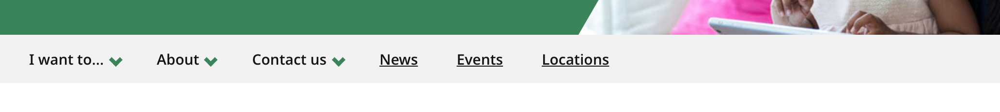 | **Recommendation:** When cursor is hovering over the link, provide users with feedback (such as a color change or bolded words) to acknowledge that the link is ready to be clicked | 3 
**Match Between System and Real World** | **Issue:**  Throughout the site, drop down menus and hyperlinks are accompanied by side arrows. Although dropdown menus utilize down areas to signify additional dropdown choices, side arrows represent to the user that they should click the link. Since down arrows represent that a dropdown menu is available, it may not be intuitve to the user that side arrows mean to click. 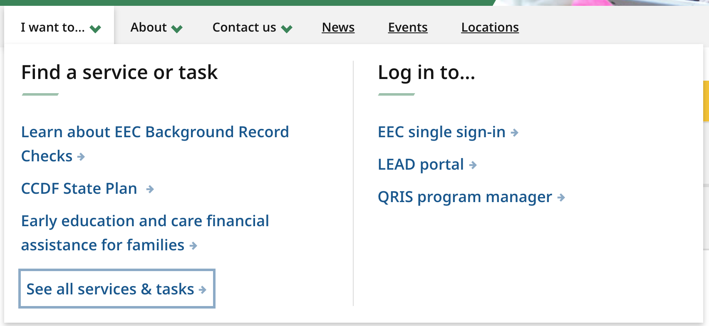 | **Recommendation:** Consider changing the side arrows to just bold or underlined text when the user is hovering over the link. | 1  
**User control and freedom** | **Issue:** After users are able to search for a specfic term or phrase in the search bar and click on a link, if they believe it is the incorrect link, there is no back button or back arrow present on the site for ease of user control and freedom. 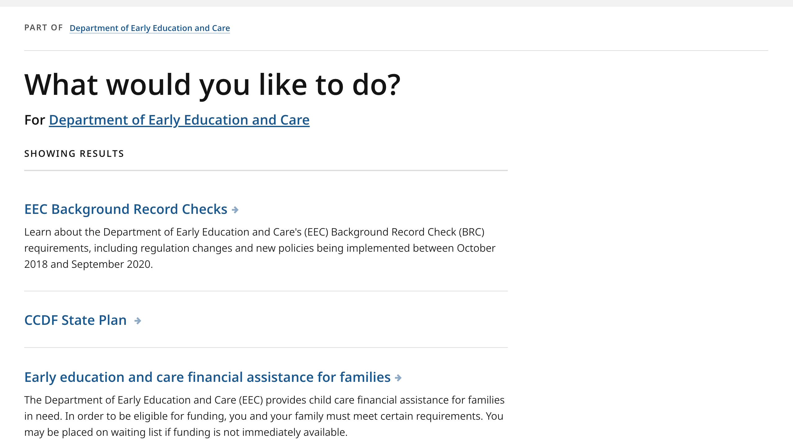 | **Recommendation:** Insert a back arrow or back button at the top or bottom of the webpage for the user | 2 
**Consistency and standards** | **Issue:**  Throughout the entire site, underlined words are hyperlinks that led users to other webpages. Yet, "Key" in the "Key Information" section on the home page only is underlined but does not take users to another page, document, or site. 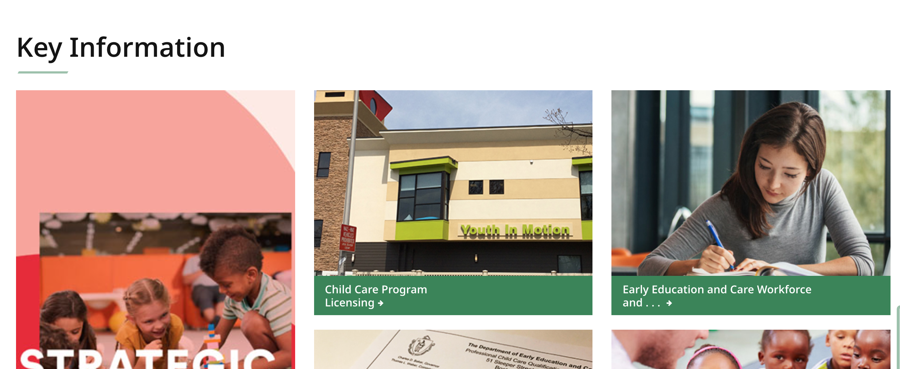| **Recommendation:** To remain consistent with the rest of the hyperlinks found throughout the site, EEC should consider boxing, changing the font, or alter the size of the font to ensure that words underlined are not mistaken for hyperlinks. | 1  
**Error prevention** | **Issue:** As the EEC is part of the Massachusetts Government website, users are able to utilize a menu button on the top left corner to navigate themselves to different sites. Unfortunately, users may believe they are still on the EEC page, and become confused with options such as "living," "working," and "visiting and exploring." 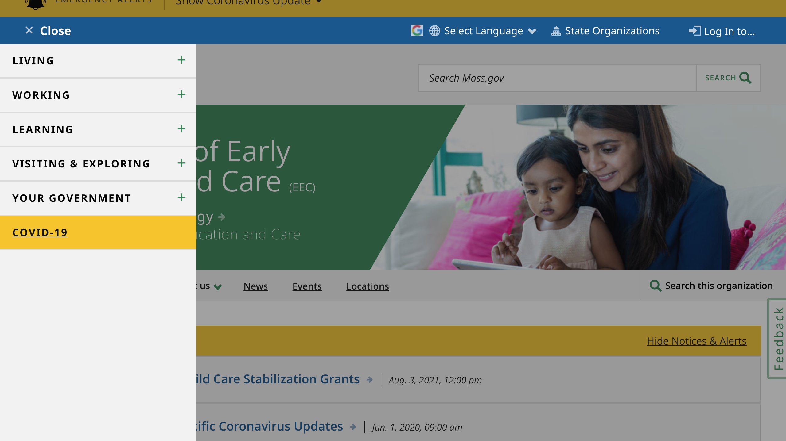 | **Recommendation:** Provide users with a small pop up to let them know they are about to exit the EEC site. | 2
**Recognition Rather than Recall** | The search bar on the site does not provide any potential search bar results when words are typed into it, overall lacking any kind of recognition feature. 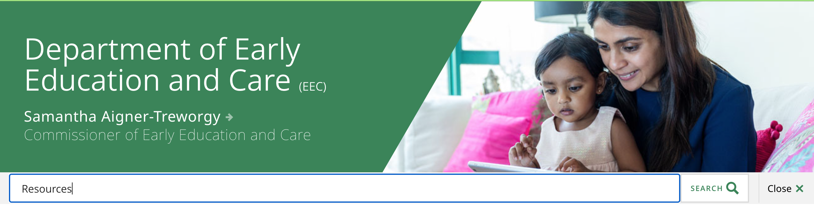 | **Recommendation:** Provide users with an auto-complete option based on the characters entered. | 2 
**Flexibility and Efficiency of Use:** | Although the page provides users with two search boxes that can provide them with flexibility, individuals on the site may become confused for which search bar to you, hindering efficiency. Even more, users may believe that because of the magnifying glass, clicking on the object may be the only way to search for items on the site. 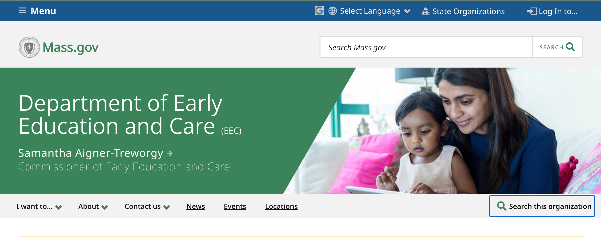 | **Recommendation:** Eliminate one of the search boxes and/or include the words "press enter" after searching. | 2 
**Aesthetic and Minimalist Design:** | **Issue:** The immense amount of text could make it difficult for users who are visually impaired or where English is their second language to stay focused or find important information. 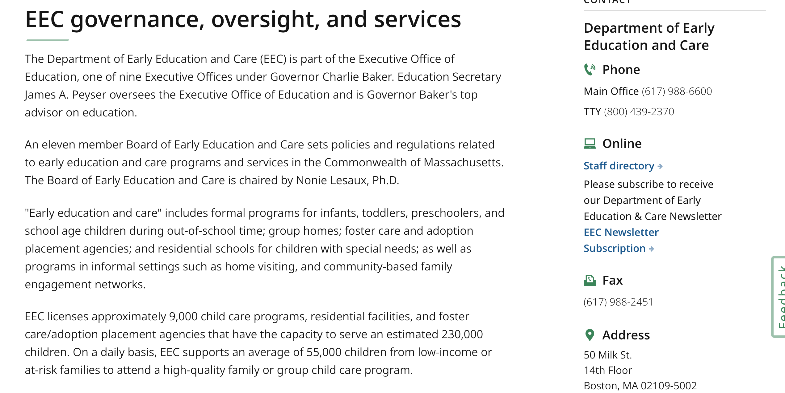 | **Recommendation:** Utilize headers, bolded words, hyperlinks, graphics and/or visuals to break up the text to assist the user in getting the needed information. | 3
**Help Users Recognize, Diagnose, and Recover from errors** | **Issue:** Although recovery directions were provided, the directions given did not work. Additionally, a bold red error message that brings users to another tab may lead people to believe that they are unable to recover from the error due to its concerning-looking text. 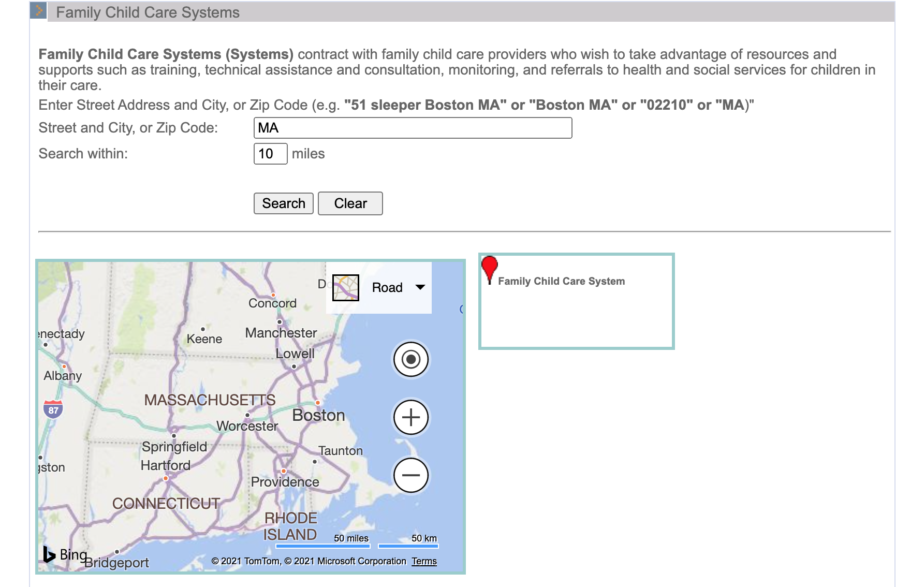 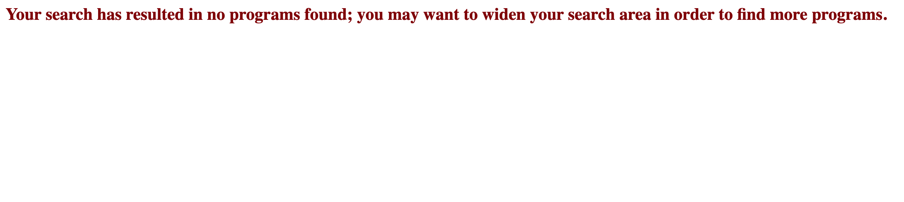| **Recommendation:** Revise color and look of error message and consider putting the error message under the search bar of the search bar instead of opening a new tab. Additionally, provide a link to an FAQ or contact information for users who cannot properly use the locator. | 3
**Help and Documentation** | **Issue:** No FAQ or help page is provided for the EEC. When clicking on the "About Us" or "Contact Us" page, links take users to a page with large amounts of text divided by general headers that don't provide individuals with specific information they may be looking for. 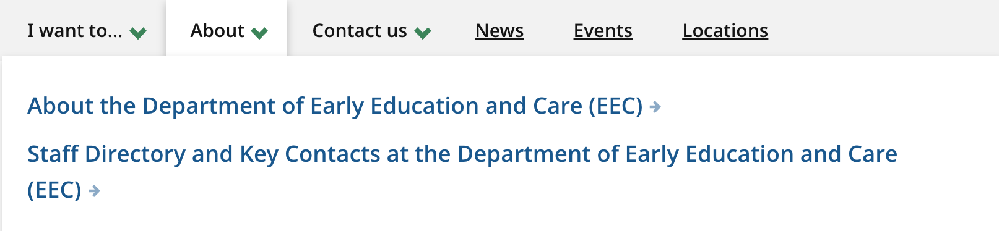 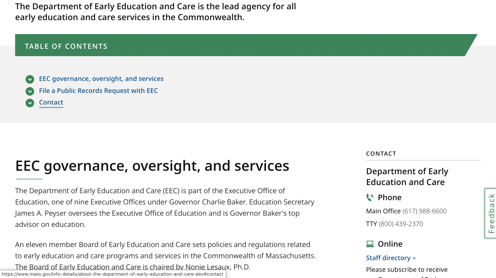 | **Recommendation:** Have an FAQ tab at the top or bottom of the home page of the website that allows users to easily access information in a succinct and efficient manner. | 3

### Website 2: [Massachusetts Department of Elementary and Secondary Education](https://www.doe.mass.edu/)
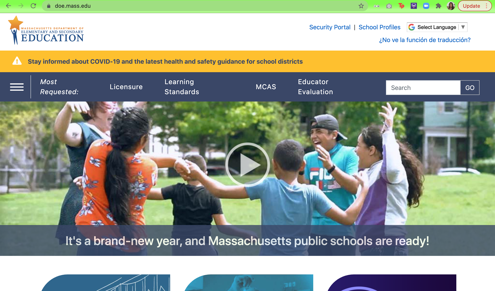
### Site Overview: 
#### The Massachusetts Department of Elementary and Secondary Education (ESE) is acknowledged by the United States Department of Education at the state education agency for the Commonwealth of Massachusetts. Ran by the Early Education Department, the main responsibility for the ESE is to promote the accessibility of early childhood resources, materials, and services accross Massachusetts for all public schools ranging from pre-k to high school. In my heuristic evaluation, my perspective will also center around a parent who uses English as a second language, is visually and physically impaired, and is interested in gaigning more information regarding resources and materials for their middle school child. Prior to the evaluation, I believe that the site was organized well, with only certain pages (such as the dropdown menu on the homepage) overlly condensed with hyperlinked text. I also noticed the availability of a "select languages" menu to change the language of the site for non-English speakers. 

### Heuristic Evaluation: 
Heuristic | ESE Heuristic Evaluation | Recommendation | Severity Rating
--------------------------|---------------------------|------------|----------------------
**Visibility of System Status:** | **Issue:** When users hover over images, no words, colors, nor increased picture sizes occur, hindering a user's ability to acknowledge that the links are embedded in the actual photos. Instead, the user may believe the word "link" should be clicked on to access the information. 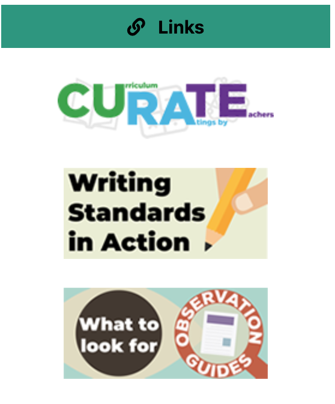 | **Recommendation:** When cursor is hovering over the link, provide users with feedback (such as a color change or bolded words) to acknowledge that the link is ready to be clicked | 3 
**Match Between System and Real World** | **Issue:** The usage of a globe on a piece of paper may not be instantly recognized as a type of news/article report from a committee affiliated with ESE nor the small rectangular icon with an error symbolzling a funds chart. 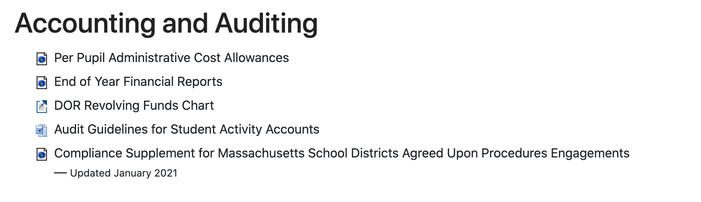 | **Recommendation:** Create a folder/tab with the words "news," "charts," etc. to ensure that users can understand what the hyperlink is or take away the icons and go into further detail on the hyperlink what the document is about. | 1  
**User Control and Freedom:** | **Issue:** Although users are given the option to go back to the top of the webpage, no arrows are provided for users who want to move onto the next page or go back a webpage. 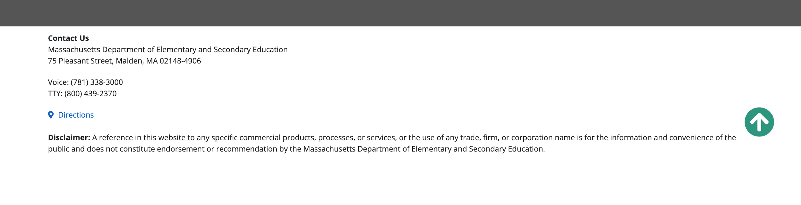  | **Recommendation:** Replace the up arrow with a 4 arrow icon that allows users to go up, down, back, or forward on and between the webpages. | 2
**Consistency and standards:** | **Issue:** Design is not consistent throughout the entire site. More specifically, some webpages are extremely text-heavy with lack of bolded text or headers to break up the paragraphs. However, other pages utilize graphics and charts with the embedding of links. 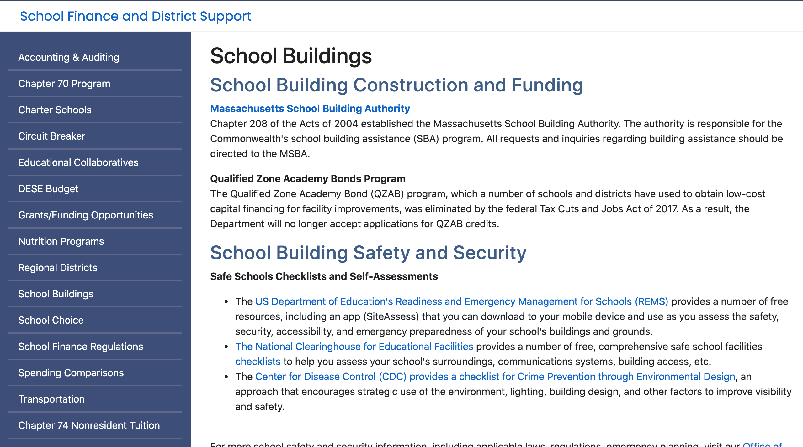 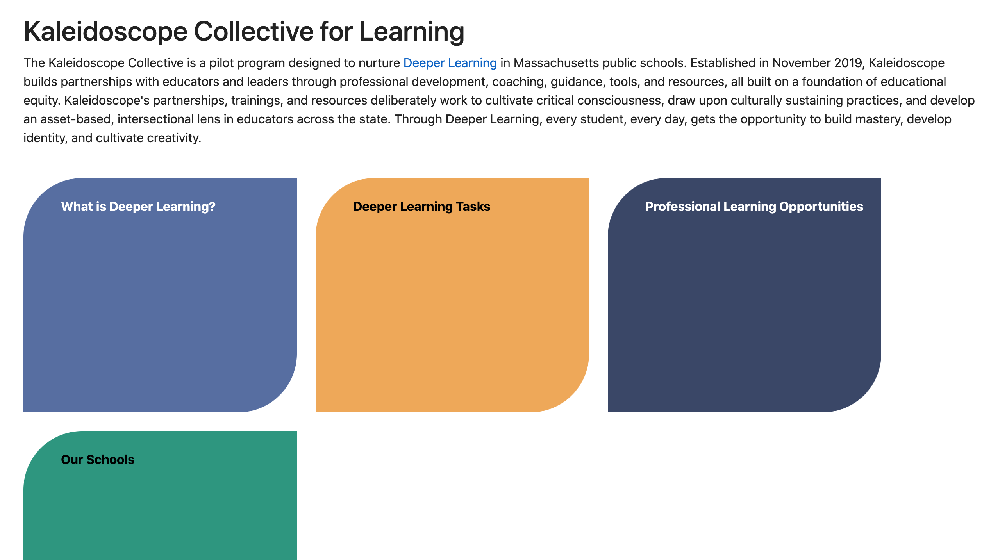 | **Recommendation:** Keep webpages consistent with the introduction of more charts and graphics for pages with larger paragraphs for a better user experience. | 2  
**Error prevention:** Provide safety nets for user, such as confirming an action. | **Issue:** There is a save button for when submitting assignments. | **Recommendation:** There seem to be enough precautions in place that will prevent the user from making any detrimental actions that cannot be undone.
**Recognition Rather than Recall | The search bar fails to provide any potential search bar results when words are typed into it. Therefore, information is retrieved less easily as the user must recall rather than recognize. 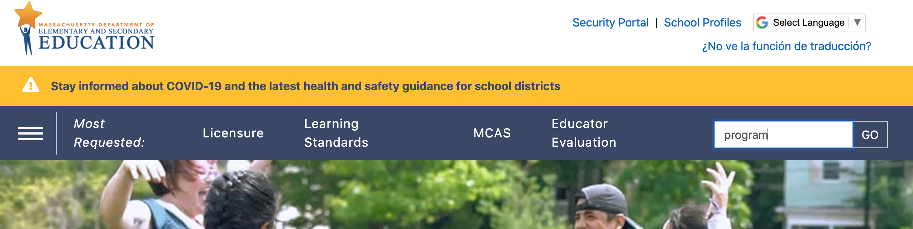 | **Recommendation:** Allow users to use an query auto-complete option to predict the user's searches based on the characters entered. | 2 
**Flexibility and efficiency of use:** |**Issue:** With the ESE's website dedicated to serving parents pre-k to high school, it may benefit users such as parents to  have the option to filter the site based on the school level their child is in (elementary, middle, high school, etc.) rather than intake a information from grades pre-k through 12th or go through the large drop down menu to search for the type of school their child is enrolled in. 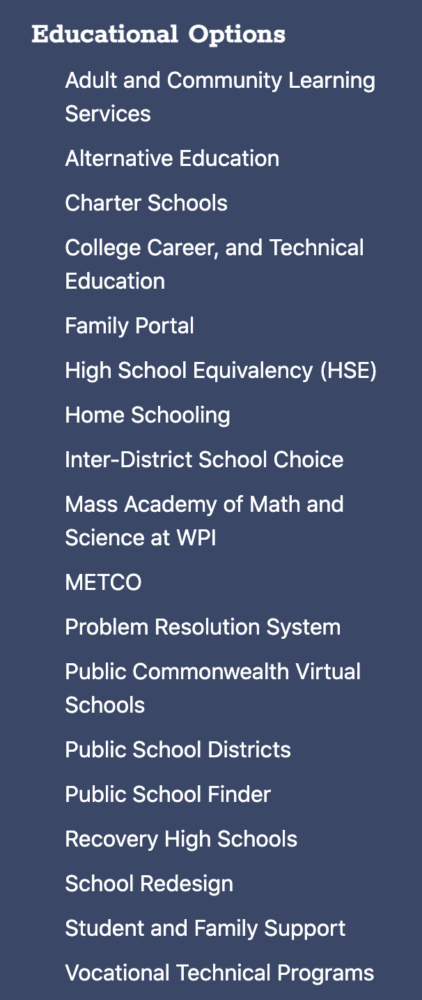  | **Recommendation:** Create an additional tab on the home page that separates certain events, news stories, finance updates, etc. by grade level. | 2
**Aesthetic and minimalist design:** | **Issue:** Massive amounts of white text on the dark navy background can be overwhelming for the user to read and/or negatively affect individuals with a visual impairment. Even more, certain links such as "About the Commissioner" and "Commissioner's Updates" under "Commissioner's Office" could be consolidated onto one webpage. 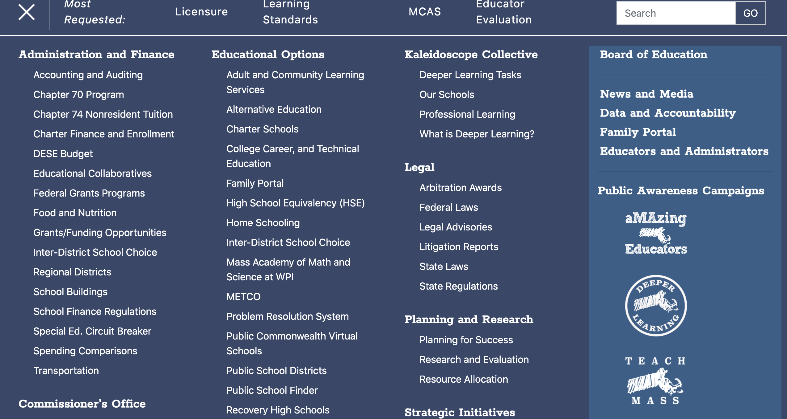 | **Recommendation:** Consolidate certain tabs or insert a few dropdown menus to shorten the length of the page. | 2 
**Help users recognize, diagnose, and recover from errors** | **Issue:** When users attempt to log into a portal, no error message shows up to direct or guide parents towards next steps in logging in or solving the issue. Even more, the maintenance message was shown before its scheduled time. 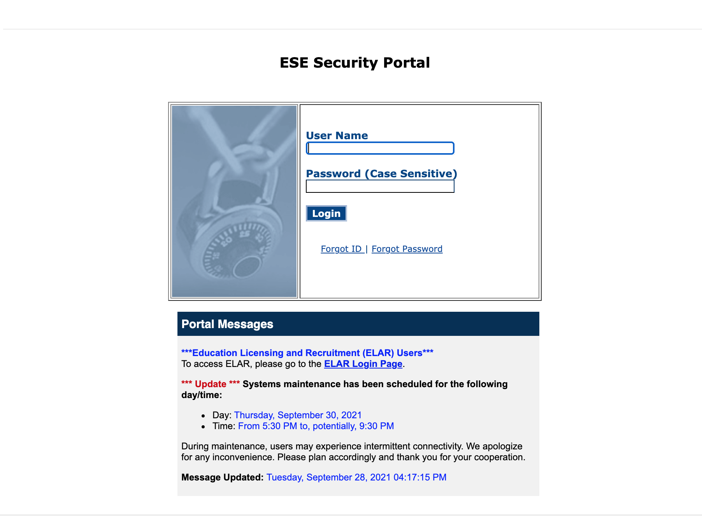 | **Recommendation:** Provide a call to action or directions for users to follow when they are unable to log into the account underneath the username and password submission. | 3 
**Help and documentation:** Have easily accessible and understandable help pages or pages with commonly asked questions. | **Issue:** No frequently asked questions link or tab is available; only contact information for a variety of education and school employees from each school district in Massachusetts. 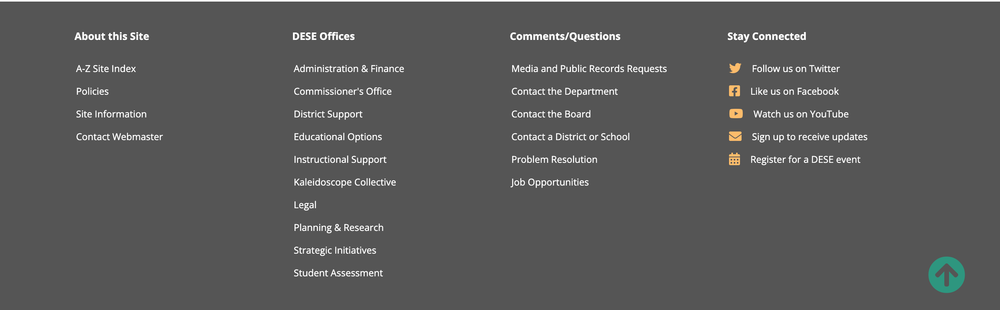 | **Recommendation:** In addition to contact information, provide users with an FAQ tab or a webpage that allows parents to directly email or send a message to the school affiliate rather than just providing contact information for more efficient and streamlined help process. | 3
