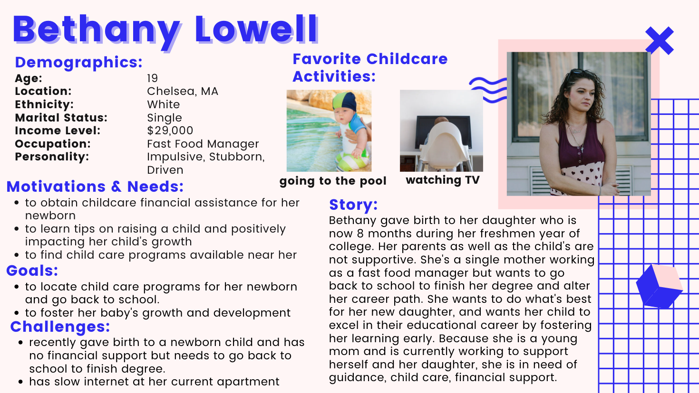
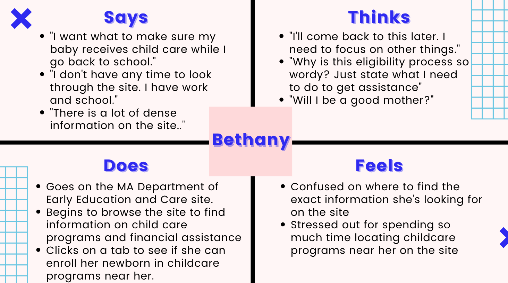
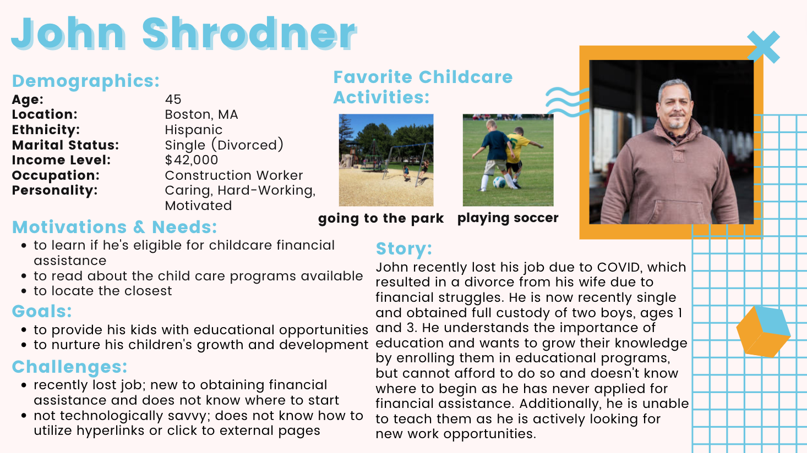
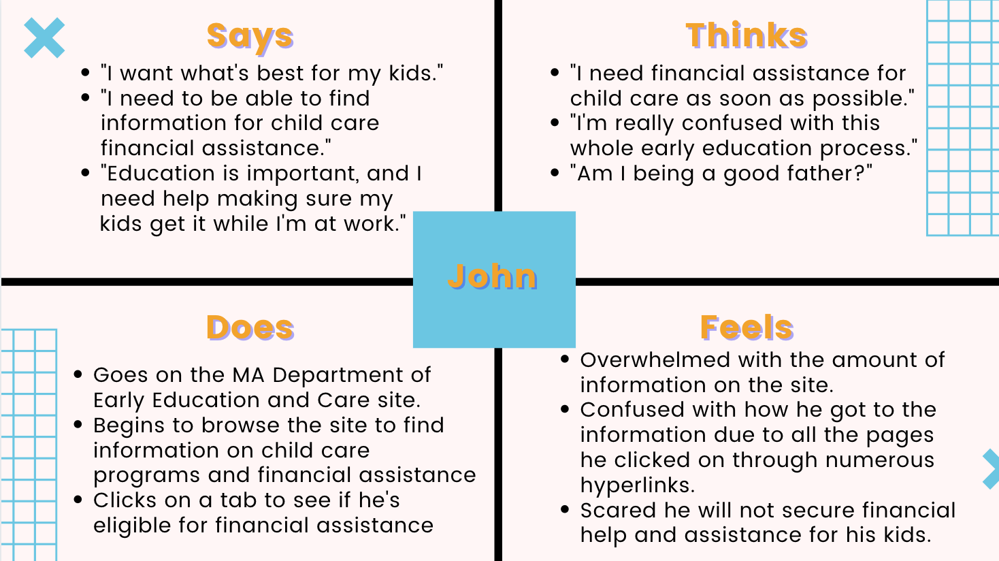

> # UX Storytelling
> ### _Karlina Ho || DGT HUM 150 || Assignment 04: Persona + Scenario_

## 🤔 *Purpose of UX Storytelling* 
* The purpose of UX Storytelling is to enable researchers and designers the opportunity to understand how a site or product provides value to the user and satisfies their needs. Additionally, by putting oneself through the user's perspective, indivudals are able to gain firsthand insight about their users' motivations, feelings, and needs and reflect on what certain areas of the design process must be altered to better fit a user's goal.   

## 💻  *Design Features*  
* Based on previous research, two design features I would propose for the UX design to ensure users are able to find information regarding child care financial assistance and early education programs include: 
  * **Filters:** the utilization of filters regarding early education programs would allow users to find the specific information needed to enroll their child in sooner, and allow users to find more personalized information that fit their current situations. Although there are currently drop down tabs and hyperlinks for users to click on information that leads them to additional pages on the site, the site is unclear in separating what programs are best fit for each specfic child. As early education and child care programs range from newborn to 12 year olds, the presence of filters will allow parents and guardians the oppprtunity to narrow down their child care options as well as input preferences. Filters would include ages, "0-3," "4-7," and so on as well as days for childcare sucha s "weekdays only," "weekends only," and "custom," where the user could input their specific days. 
  *  **Auto-Complete Search Bar:** search bars with the presence of a query auto-complete option to predict the user's searches based on their characters entered allow users to efficiently locate the information they are looking for on a site and narrow down their specific searches. As the site itself holds lots of information with pages that are full of lengthy information, an autocomplete bar would allow users to recognize what they are searching for rather than recall.  

## 👨‍👩‍👧‍👦 *Persona & Empathy Map*
> ### Persona 1: **Bethany, the teen mother** 

> ### Persona 2: **John, the recent divorcee** 

## 📖 *Scenarios & Journey Map*

two customer personas: 
Teen parent looking to seek child care programs for her newboarn son to return back and oursue her college degree 
Newly divorced father of two (1 and 3 year olds), recently lost his job and wife due to financial struggles and looking to get back on track  
