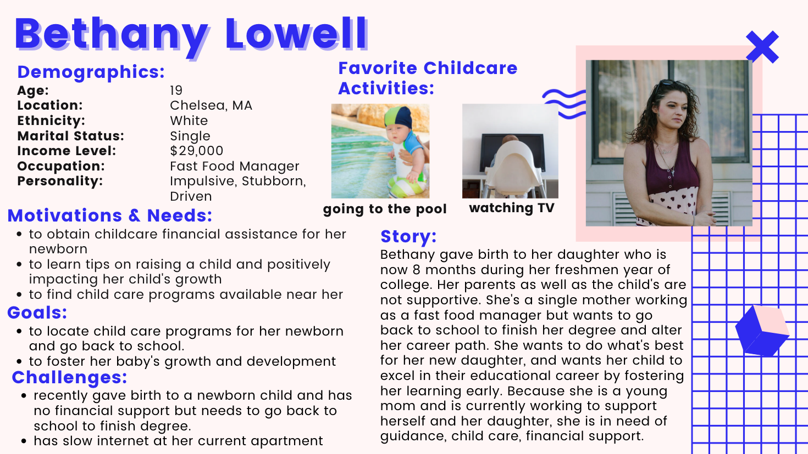
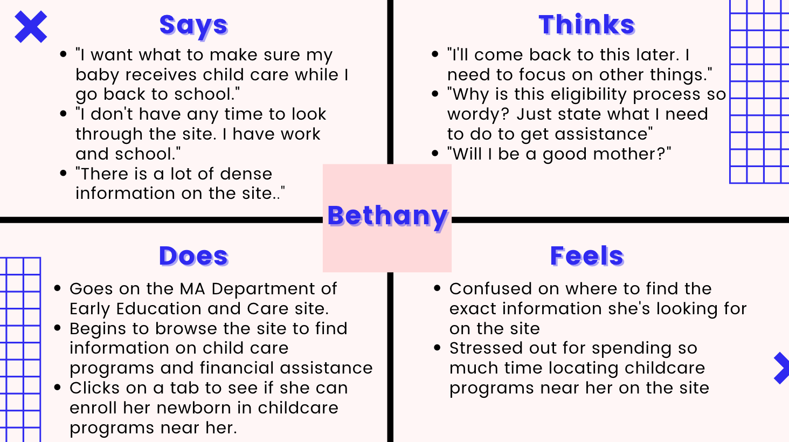
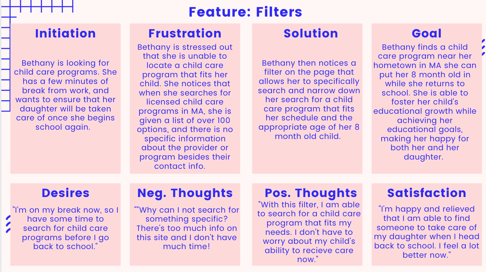
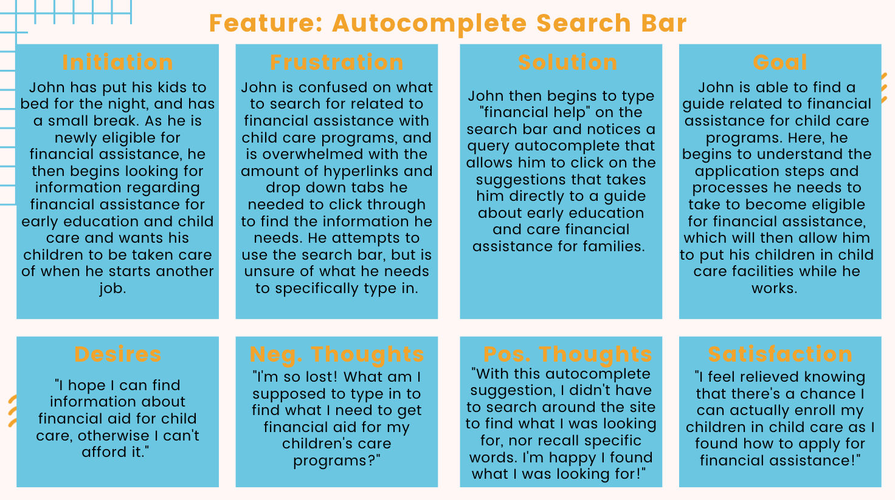

> # UX Storytelling
> ### _Karlina Ho || DGT HUM 150 || Assignment 04: Persona + Scenario_

## 🤔 *Purpose of UX Storytelling* 
* The purpose of UX Storytelling is to enable researchers and designers the opportunity to understand how a site or product provides value to the user and satisfies their needs. Additionally, by putting oneself through the user's perspective, indivudals are able to gain firsthand insight about their users' motivations, feelings, and needs and reflect on what certain areas of the design process must be altered to better fit a user's goal.   

## 💻  *Design Features*  
* Based on previous research, two design features I would propose for the UX design to ensure users are able to find information regarding child care financial assistance and early education programs include: 
  * **Filters:** the utilization of filters regarding early education programs would allow users to find the specific information needed to enroll their child in sooner, and allow users to find more personalized information that fit their current situations. Although there are currently drop down tabs and hyperlinks for users to click on information that leads them to additional pages on the site, the site is unclear in separating what programs are best fit for each specfic child. As early education and child care programs range from newborn to 12 year olds, the presence of filters will allow parents and guardians the oppprtunity to narrow down their child care options as well as input preferences. Filters would include ages, "0-3," "4-7," and so on as well as days for childcare sucha s "weekdays only," "weekends only," and "custom," where the user could input their specific days. 
  *  **Auto-Complete Search Bar:** search bars with the presence of a query auto-complete option to predict the user's searches based on their characters entered allow users to efficiently locate the information they are looking for on a site and narrow down their specific searches. As the site itself holds lots of information with pages that are full of lengthy information, an autocomplete bar would allow users to recognize what they are searching for rather than recall.  

## 👨‍👩‍👧‍👦 *Persona & Empathy Map*
> ### Persona 1: **Bethany, the teen mother** 

> ### Persona 2: **John, the recent divorcee** 

## 📖 *Scenarios & Journey Map*
> ### Scenario 1: **Bethany** 
* Bethany has a 30 minute lunch break before she begins work again. While sitting in the break room, she decides to go on the Massachusetts Department of Early Education and Care site to search for early child care programs she can put her 8 month old daughter in when she returns back to college in the fall. On her phone, she fills out the information needed to locate the child care programs near her and hopes to briefly find some childcare options before continuning work. 
* When searching for a licsensed child care program, she fills out the radius requirements for her hometown of Chelsea, MA, and sets her radius to 15 miles. After clicking the search bar, she is met with over 100 search results with the first result showing, "A Bright Beginning Too 132 NORTH ST Danvers, MA 01923-1242." yet she scrolls and immediately finds countless child care options with just names and contact information, and becomes instantly overwhelmed. She doesn't know exactly what ages each child care center takes care of and is unsure if the child care centers can accommadate her school schedule. "If only there was a way to further filter these searches to narrow down a smaller list of child care centers I can put my child in," she thinks to herself. 
* Fortunately for Bethany, she then sees a filter option on the side of her screen that allows her to further search for child care options by weekdays, weekends, or custom days of the week while selecting specific ages each child care facility can take care of. After utilizing this filter, she is met with 15 child care facilities instead of over 100. 
* Bethany then searches up a few of the programs suggested to her, and quickly creates a list of child care centers to call when she gets another break. Instead of spending hours looking through hundreds of child care options, the filter options allowed Bethany to efficently locate a list of child care programs that tailored to her needs, making her extremely happy that she is able to go back to college. She then hears her alarm go off, turns off her phone, and heads back to her job happy that she had viable child care options. 

> ### Scenario 2: **John** 

