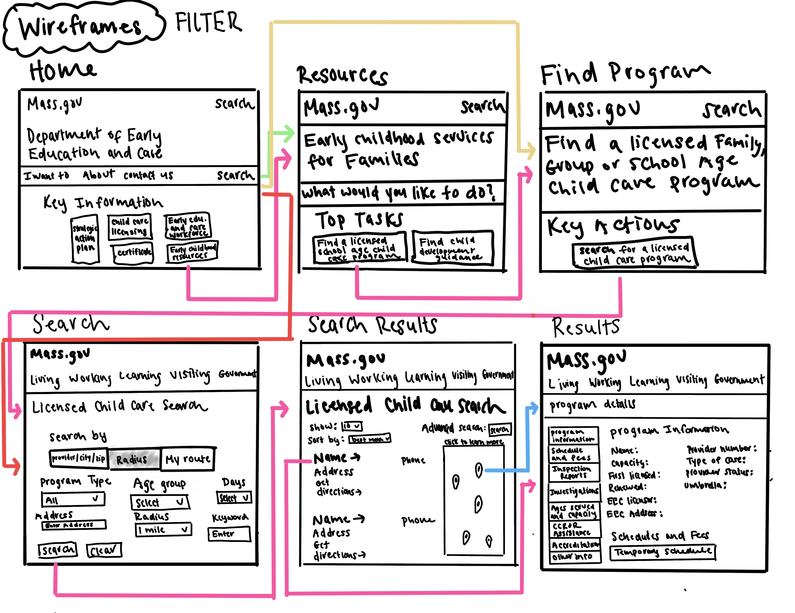
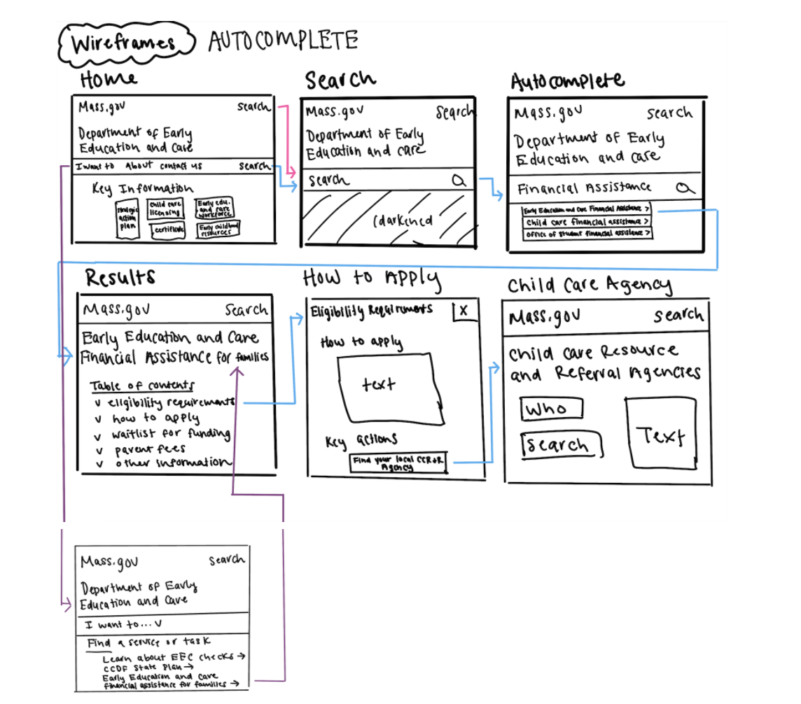
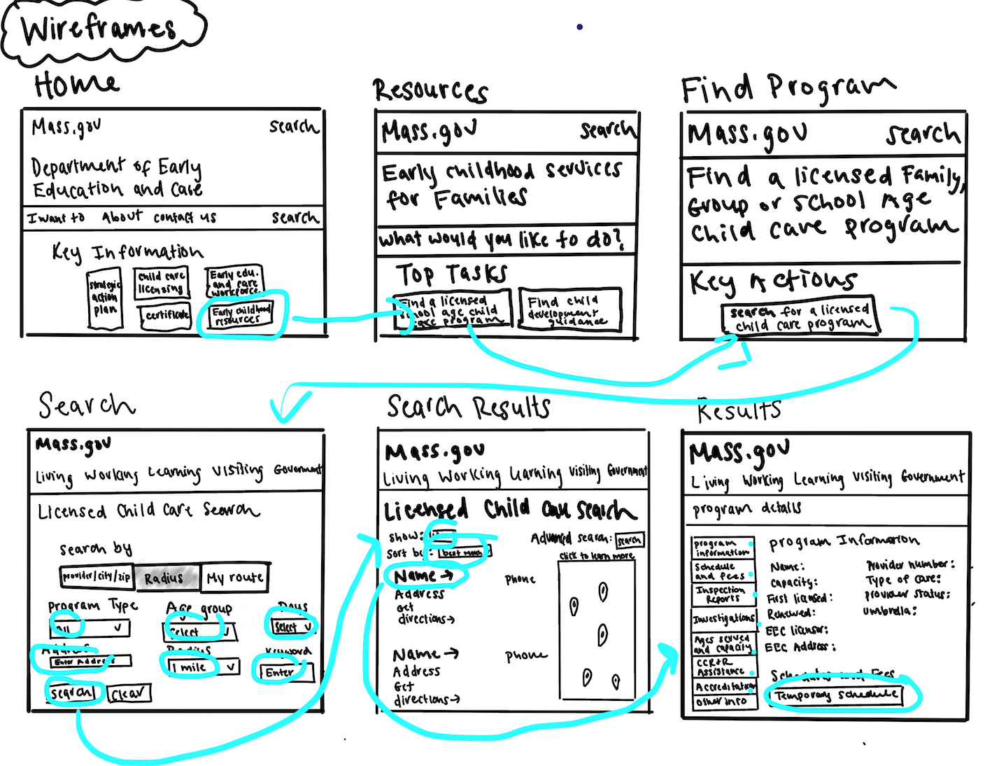
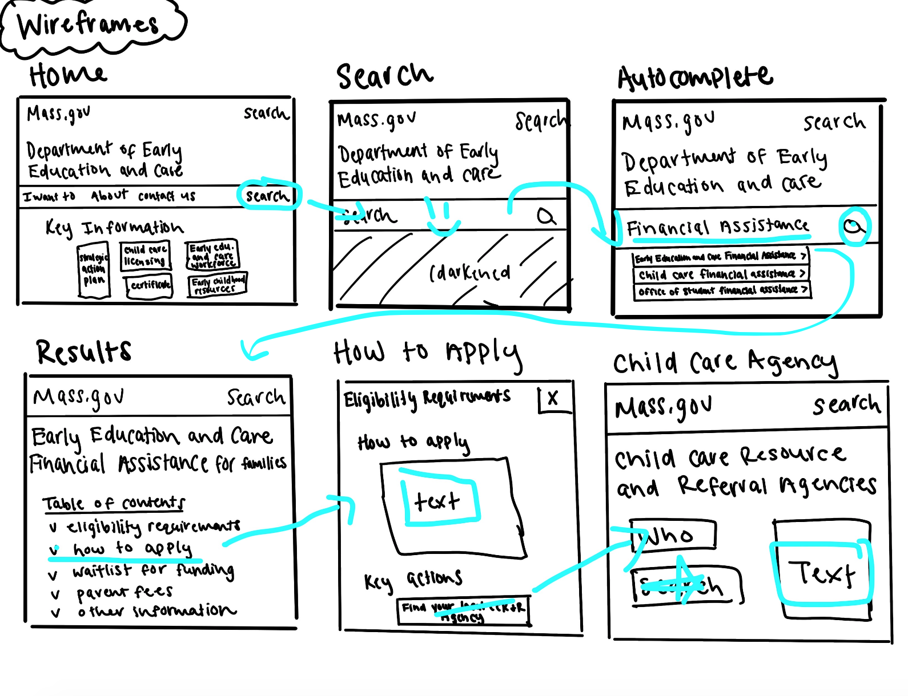

> # Low Fidelity Prototype
> ### _Karlina Ho || DGT HUM 150 || Assignment 05: UX Wireframe/Paper Protoype_

## 📱 *Overview* 
### *Purpose* 
* Low-fidelity prototyping provides individuals with a quick and easy opportunity to transform high-level design prototypes and concepts into physical and demonstrable products to ultimately gain user feedback and implement needed changes throughout the design cycle. Additionally with this feedback, designers are able to address and resolve problems for users at an early stage.  
* By creating a low-fidelity prototype and testing the prototype with another individual, I am able to make the necessary changes needed for users through the feedback of others before creating a high-fidelity prototype. 

### *User Research* 
* Based on my [user research](https://github.com/KarlinaHo/DH110-KarlinaHo/blob/main/DH110%20Assignment/Assignment03README.md) (contextual inquiry), this assignment will focus itself around three research questions including: 
  * How might we improve the Massachusetts Department of Early Education and Care Site to provide users with information related to child care and early education programs?
  * How might the site become more efficient for users to search for financial assistance related to child care and early education programs?
  * How might users find contact information for child care and early education programs in a more streamlined manner? 

### *Personas and Scenarios*
* Using these research questions, [UX Storytelling](https://github.com/KarlinaHo/DH110-KarlinaHo/blob/main/DH110%20Assignment/Assignment04README.md) through personas and empathy maps were utilized to gain firsthand insight on the motivations, goals, and feelings of potential users regarding the suggested design features to achieve goals in a more efficent manner. Two personas were created to address the above research questions such as: 
  * A teen mother who needed to locate child care programs for her newborn to go back to school in a timely manner.
  * A recent male divorcee who wanted to learn if he was eligible for financial child care financial assistance as a result of his lost job. 

### *Tasks/Features*
* The tasks and features of the low-fi protoype in this assignment stem from user research such as usability testing of current MA Deapartment of Early Education and Care (EEC) site features to inquire about financial assistance for early education and care programs in Massachusetts. contextual inquiry of potential target users, and additional overservations based on my own personal experiences with the EEC site. With this in mind, the two tasks/features that the system will need to support includes: 
  * Narrowing child care program options with additional/advanced filters 
  * Including auto-complete search bar to predict user's searches on EEC site

## 📱 *Wireframes and Wireflows* 
### Filter Wireframe + Wireflow 
### Autocomplete Wireframe + Wireflow 

## 📱 *Testing* 
### User Interactions
  * To test the low fidelity prototype, I conducted the interview via Zoom utilizing the pen tool found on pages on Apple laptops. On the test, I shared my prototype with my interviewee on a shared Zoom screen, and had them use the pen tool to circle and mark the buttons they would click as if the prototype were actually digital. Although the participant asked to not be recorded, I was given permission to use their actual user interaction pages they completed during the interview. The tasks are found below: 

### Task 1: Filter Wireflow 
  * Navigate to Child Care Programs. 
  * Utilize filter functions to narrow down Child Care Program search results. 
  * Learn about the program details of a Child Care Program and begin schedule an appointment. 

### Task 2: Autocomplete Wireflow
  * Search for Financial Assistance for Early Education and Care Programs. 
  * Utilize search autocomplete functions to provide recognition rather than recall for website information.  
  * Obtain contact information for Child Care Resource and Referral Agencies.

## 📱 *Reflection* 
* Overall, testing out the low-fidelity prototype went well, and the entire process was extremely beneficial to me in regards to understanding the feasability and plausability of my suggested site improvements. Throughout the interview, there were a few notable things that arose: 
   * During the first task, the interviewee initially was going to click on the button labeled, "child care licensing," but decided to click on the button labled, "early childhood resources." Although early childhood resources is the correct button to click on to get to the desired information regarding licesned childcare locations, it is worth noting that labels and text must be more specific and provide users with links that are not conflicting with one another. 
   * On the second task, the interviewee did not initially understand that users were able to click on the suggested dropdown auto-query searches as a result of the pre-written sketch/prototype. This ultimately led to some confusion regarding the accessibility and efficiency of the search bar in comparison to the hyperlinks scattered throughout the site. 
* Overall, sketching the low-fidelity prototype was extremely beneficial in getting to understand the functions and offerings of the intitial site. Unfortunately, I believed that the drawing oftentimes contained words that made users spend slightly more time decoding than they would if the prototype was made via digital tools and platforms such as Figma. In the future, I hope to continue to build upon the culimination of knowledge gained from both this and past assignments, and applied the knowledge learned when eventually constructing my high-fidelity prototypes. 

